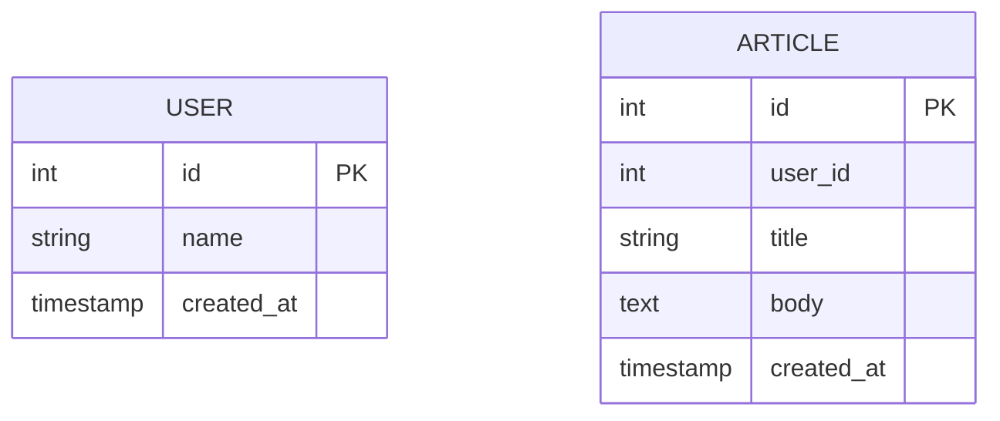

## はじめに

Dataform では SQLX ファイルにデータの取得先、データの変換、データの保存先等様々定義します。
この記事では、SQLX ファイルの基本的な記述方法とその活用例について詳しく解説します。

## SQLX ファイルとは

Dataform で扱う SQLX ファイルは SQL と JavaScript を 1 ファイルに記述します。

はじめににも記載している通り、 SQLX ファイルには 「データの取得先」「データの変換処理」「データの保存先」を定義します。

SQLX はメジャーなファイル形式ではないため、シンタックスハイライト等エディタで利用できないことが補とんとです。
(動作確認出来ているのは) VSCode と Vim/Neovim だけですが Plugin もあります。

https://qiita.com/mziyut/items/5dc8854fac13e04327f6

## SQLX ファイルの記載する内容

SQLX ファイルには、拡張子名そのまま SQL を記載します。また、必要に応じてデータ入出力等を設定する Config や、共通処理等を定義、利用する JavaScript も記述することが出来ます。
上記に記載した、それぞれ記述する各項目について簡単な例を書いてみました。

### Config

Config は 出力先の情報(Table や Column) の定義や、 assertion や uniqueKey 等テストに必要な定義を行います。
今回は、 Google Cloud 上の Dataform を利用し Dataform を動かす想定であり、共通の出力先設定などは `dataform.json` に記載しており、各 sqlx ファイルには個別指定しません。

```sqlx:hoge.sqlx
config {
  type: "table",
  description: "Description of the record",
  columns: {
    id: "PK",
    name: "User name"
  }
}
```

https://cloud.google.com/dataform/docs/document-tables?hl=ja#add_column_and_record_descriptions

ただし、 Label や Partition 定義等必要に応じて定義してください。
Config に設定するオプションは数が多いので以下ページを参考にしてください。

https://docs.dataform.co/reference#ITableConfig

https://docs.dataform.co/reference#IBigQueryOptions

### SQL

字の通り SQL を記載します。簡単な Table を用意しました。



上記のような Table があったとします。
USER と ARTICLE のデータを使い 1 つのデータを作成するような場合は以下 SQL を sqlx ファイルに定義します。
SQL の実行結果が Config で定義した Table/View 等に出力されます。

```sqlx:hoge.sqlx
SELECT
  USER.id AS user_id,
  ARTICLE.id AS article_id,
  ARTICLE.title AS article_title
FROM
  USER
JOIN
  ARTICLE ON (USER.id = ARTICLE.user_id)
```

### JavaScript

Dataform は SQL だけでなく、 JavaScript を使って処理や変数等をまとめて定義、利用できます。
実際に JavaScript を定義して使う場面は別の記事として公開していますのでこちらを確認してください。

https://qiita.com/mziyut/items/ccf2c58ae44c49a34b04

### 最後に

SQLX に定義する Config, SQL, JavaScript それぞれを簡単に説明しました。
例に挙げた定義を 1 つの SQLX に書くと以下のようになります。

```sqlx:hoge.sqlx
config {
  type: "table",
  description: "Description of the record",
  columns: {
    id: "PK",
    name: "User name"
  }
}

js {
  // 定義する必要があれば記載
}

SELECT
  USER.id AS user_id,
  ARTICLE.id AS article_id,
  ARTICLE.title AS article_title
FROM
  USER
JOIN
  ARTICLE ON (USER.id = ARTICLE.user_id)
```

Dataform は SQLX 以外に JavaScript だけを使用することもできますが、SQLX を利用するほうが直感的かつ簡単に定義し利用できるのでとてもおすすめです。

https://cloud.google.com/dataform/docs/javascript-in-dataform?hl=ja

## References

https://docs.dataform.co/guides/sqlx
